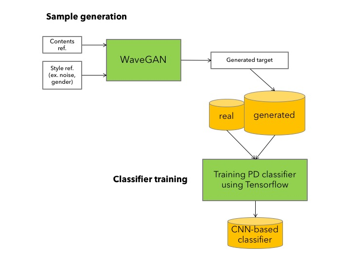
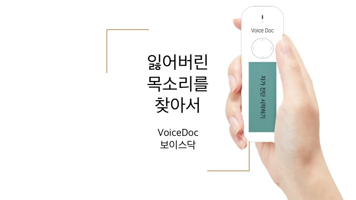

# Speech-based Parkinson's Disease Classifier

In this project we use Deep learning to classify Parkinson's disease in four classes. To build an accurate model, we synthesized speech using WaveGAN [[paper](https://arxiv.org/abs/1802.04208)] and augmented speech using newly developed GAN [[github repo](https://github.com/anooptoffy/DLJeju2018CodeRepoASR)].

## Getting Started

Parkinson’s disease (PD) is impacting more than 10 million people worldwide. However, the conventional method of diagnosing PD based on physicians’ decision is time consuming and often inaccurate. Hence, we aim to develop an accurate deep learning diagnosis model of PD based on vocal symptoms of hypokinetic dysarthria unique to PD. With the help of deep learning, which does not require complex feature extraction and selection steps necessary in machine learning, we have successfully increased the efficiency as well as the accuracy of the classification model. Furthermore, parameters such as the volume of voice, quality of the recording, and patient’s ethnicity may confound the diagnosis. We propose to implement Generative Adversarial Network (GAN) to revise these parameter values into a standard threshold. The revised inputs, when put into a network that is particularly trained with the threshold, resulted in higher accuracy.

## Proposed System

* Software

* Hardware

## Usage

### Prerequisites

* Tensorflow >= 1.4
* Python 3.6

### Datasets

1. Noisy [DEMAND](https://zenodo.org/record/1227121) [2](http://staff.ustc.edu.cn/~jundu/The%20team/yongxu/demo/115noises.html)
2. [Speech Commands Zero through Nine (SC09)](https://drive.google.com/open?id=1qRdAWmjfWwfWIu-Qk7u9KQKGINC52ZwB)
3. Techsorflow Challenge [Speech Commands data full](https://www.kaggle.com/c/tensorflow-speech-recognition-challenge/data)
4. Parkinson's Disease Extended Vowel Sound dataset (not public)

### Baseline PD Classifier

We are using the four class classifier based on CNN. [[baseline](https://www.tensorflow.org/tutorials/audio_recognition)] [[paper](https://www.isca-speech.org/archive/interspeech_2015/papers/i15_1478.pdf)]

### GAN based Speech Synthesis system

We are using [WaveGAN](https://github.com/chrisdonahue/wavegan) and newly proposed [GAN model](https://github.com/anooptoffy/DLJeju2018CodeRepoASR) for speech Synthesis from the training data.

### References

* Little MA, et al. "Suitability of dysphonia measurements for telemonitoring of Parkinson’s disease." IEEE Transactions on Bio-medical Engineering. 2009. [[paper](https://www.ncbi.nlm.nih.gov/pmc/articles/PMC3051371/pdf/nihms-118450.pdf)]
* Tsanas, A., et al. “Novel Speech Signal Processing Algorithms for High-Accuracy Classification of Parkinson's Disease.” IEEE Transactions on Biomedical Engineering. 2012. [[paper](https://research.aston.ac.uk/portal/files/3400339/Novel_speech_signal_processing_algorithms.pdf)]
* Donahue, Chris, Julian McAuley, and Miller Puckette. "Synthesizing Audio with Generative Adversarial Networks." arXiv preprint arXiv:1802.04208 (2018). [[paper](https://arxiv.org/abs/1802.04208)]
* Shen, Jonathan, et al. "Natural TTS synthesis by conditioning wavenet on mel spectrogram predictions." arXiv preprint arXiv:1712.05884 (2017). [[paper](https://arxiv.org/pdf/1712.05884.pdf)]
* Perez, Anthony, Chris Proctor, and Archa Jain. Style transfer for prosodic speech. Tech. Rep., Stanford University, 2017. [[paper](http://web.stanford.edu/class/cs224s/reports/Anthony_Perez.pdf)]
* Goodfellow, Ian, et al. "Generative adversarial nets." Advances in neural information processing systems. 2014. [[paper](https://arxiv.org/pdf/1406.2661.pdf)]
* Salimans, Tim, et al. "Improved techniques for training gans." Advances in Neural Information Processing Systems. 2016. [[paper](https://arxiv.org/pdf/1606.03498.pdf)]
* Grinstein, Eric, et al. "Audio style transfer." arXiv preprint arXiv:1710.11385 (2017). [[paper](https://arxiv.org/abs/1710.11385)]
* Pascual, Santiago, Antonio Bonafonte, and Joan Serra. "SEGAN: Speech enhancement generative adversarial network." arXiv preprint arXiv:1703.09452 (2017). [[paper](https://arxiv.org/pdf/1703.09452.pdf)]
* Yongcheng Jing, Yezhou Yang, Zunlei Feng, Jingwen Ye, Yizhou Yu, Mingli Song. "Neural Style Transfer: A Review" 	arXiv:1705.04058 (2017) [[paper](https://arxiv.org/abs/1705.04058v6)]
* Van Den Oord, Aäron, et al. "Wavenet: A generative model for raw audio." CoRR abs/1609.03499 (2016). [[paper](https://arxiv.org/abs/1609.03499)]
* Glow: Generative Flow with Invertible 1×1 Convolutions [[paper](https://d4mucfpksywv.cloudfront.net/research-covers/glow/paper/glow.pdf)]
* Kingma, Diederik P., et al. "Semi-supervised learning with deep generative models." Advances in Neural Information Processing Systems. 2014. [[paper](https://arxiv.org/abs/1406.5298)]
* Van Den Oord, Aäron, et al. "Wavenet: A generative model for raw audio." CoRR abs/1609.03499 (2016). [[paper](https://arxiv.org/abs/1609.03499)]

## Authors

* **Chae Young Lee** - *Hankuk Academy of Foreign Studies* - [[github](https://github.com/acheketa)]
* **Anoop Toffy** - *IIIT Bangalore* - [[Website](www.anooptoffy.com)]
* **Seo Yeon Yang** - *Seoul National University* - [[Website](http://howtowhy.wixsite.com/stellayang)]

## License

This project is licensed under the MIT License - see the [LICENSE.md](LICENSE.md) file for details

## Acknowledgments

* Prof. Giovanni Dimauro, Universita' degli Studi di Bari 'Aldo Moro'
* Dr. Woo-Jin Han, Netmarble IGS
* Dr. Gue Jun Jung, SK Telecom
* Tensorflow Korea
* Google Korea